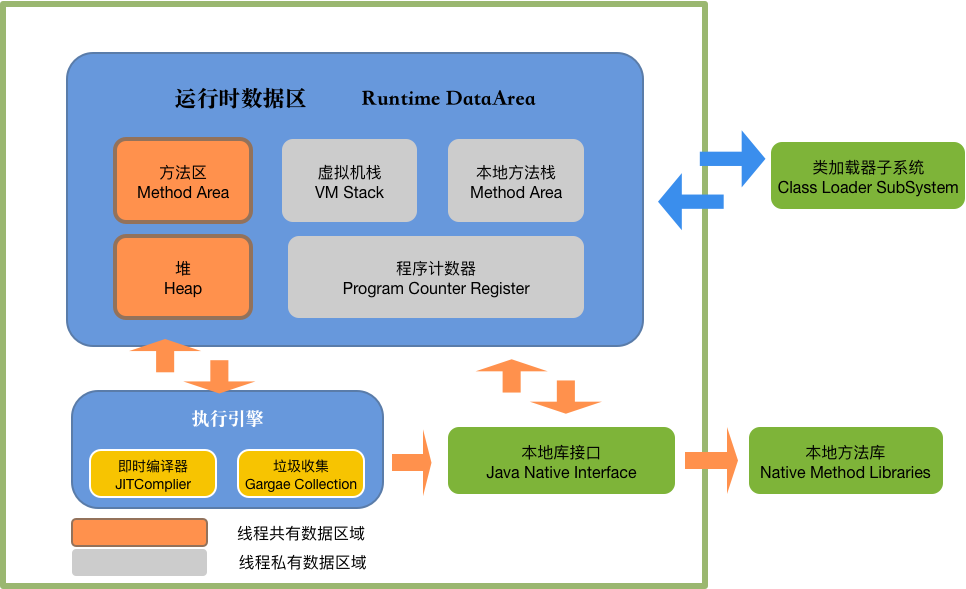
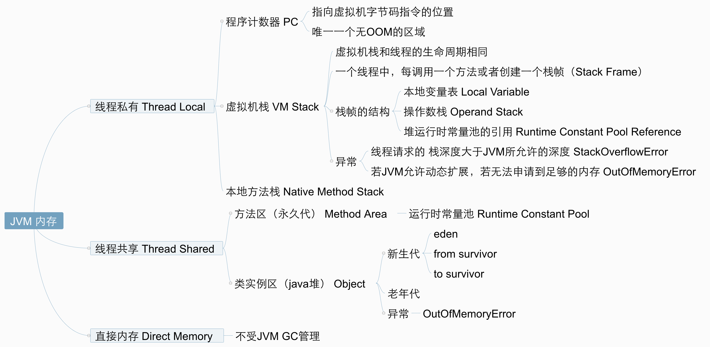
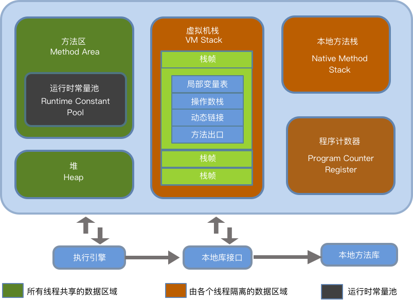

# JVM

**（1）基本概念**

​	JVM是可运行Java代码的假想计算器，包括一套字节码指令集、一组寄存器、一个栈、一个垃圾回收、堆和一个存储方法域。JVM是运行在操作系统之上，它与硬件没有直接的交互。


(2)运行过程

​	我们都知道Java源文件，通过编译器，能够产生相应的.class文件，也就是字节码文件，而字节码文件有通过Java虚拟机中的解释器，编译成特定机器上的机器码。

也就是如下：

​	①Java源文件—>编译器—>字节码文件

​	②字节码文件—>JVM—>机器码

​	每一种平台的解释器是不同的，但是实现的虚拟机是相同的，这也是Java为什么能够跨平台的原因，当一个程序从开始运行，这是虚拟机就凯斯实例化了，多个程序启动就会存在多个虚拟机示例。程序退出或者关闭，则虚拟机示例消亡，多个虚拟机示例之间数据不能共享。




## 2.1.线程

​	这里所说的线程指程序执行过程中的一个线程实体。JVM 允许一个应用并发执行多个线程。Hotspot  JVM 中的 Java 线程与原生操作系统的线程有直接的映射关系。当本地线程存储、缓存区分配、同步对象、栈、程序计数器等准备好后，就会创建一个操作系统原生线程。Java 线程结束，原生线程随之被回收。操作系统负责调度Java线程的 run() 方法。当线程结束时，会释放原生线程和 Java 线程的所有资源。

​	Hotspot JVM 后台运行的系统线程主要有下面几个：

| 虚拟机线程            (VM thread) | 这个线程等待 JVM 到达安全点操作出现。这些操作必须要在独立的线程中里执行，因为当堆修改无法进行时，线程都需要 JVM 位于安全点。这些操作的类型有： stop-the-world 垃圾回收、线程 dump、线程暂停、线程偏向锁 (biased locking) 接触 |
| ---------------------------------- | ------------------------------------------------------------ |
| 周期性任务线程                     | 这些线程负责定时器时间 (也就是中断)，用来调度周期性操作的执行 |
| GC 线程                            | 这些线程支持 JVM 中不同的垃圾回收活动。                      |
| 编译器线程 | 这些线程在运行时将字节码动态编译成本地平台相关的机器码 |
| 信号分发线程 | 这个线程接收发送到 JVM 的信号并调用适当的 JVM 方法处理 |


## 2.2.JVM 内存区域



​	JVM 内存区域主要分为线程私有区域【程序计数器、虚拟机栈、本地方法区】、线程共享区域、【JAVA 堆、方法区】、直接内存。

​	线程私有数据区域生命周期与线程相同，依赖用户线程的启动/结束 而 创建/销毁(在 Hotspot VM 内，每个线程都与操作系统的本地线程直接映射，因此这部分内存区域的存/否跟随本地线程的生/死对应)。

​	线程共享区域随虚拟机的启动/关闭而创建/销毁。

​	直接内存并不是 JVM 运行时数据区域的一部分，但也会被频繁的使用：在 JDK 1.4 引入的 NIO 提供了基于 Channel 与 Buffer 的 IO 方式，它可以使用 Native 函数库直接分配堆外内存，然后使用 DirectByteBuffer 对象作为这块内存的引用进行操作(详见：Java I/O 扩展)，这样就避免了再 Java 堆和 Native 堆中来回复制数据，因此在一些场景中可以显著提高性能。




### 2.2.1.程序计数器

​	一块较小的内存空间，是当前线程所执行的字节码的行号指示器，每条线程都要有一个独立的程序计数器，这类内存也称为"线程私有"的内存。

​	正在执行的 Java 方法的话，计数器记录的是虚拟机字节码指令的地址 (当前指令的地址) 。如果是 Native 方法，则为空。

​	这个内存区域是唯一一个在虚拟机中没有规定任何 OutOfMemoryError 情况区域。

### 2.2.2.虚拟机栈 (线程私有)

​	虚拟机栈是描述 Java 方法执行的内存模型，每个方法在执行的同事都会创建一个栈帧 (Stack Frame) 用于存储局部变量表、操作数栈、动态链接、方法出口灯信息。每一个方法从调用直至执行完成的过程，就对应着一个栈帧在虚拟机中入栈到出栈的过程。

​	栈帧 (Stack Frame) 是用来存储数据和部分过程结果的数据结构，同时也被用来动态处理动态链接 (Dynamic Linking)、方法返回值和异常分派 (Dispatch Exception) 。栈帧随着方法调用而创建，随着方法结束而销毁——无论方法是正常完成异常完成 (抛出了在方法内未被捕获的异常) 都算做方法的结束。


### 2.2.3.本地方法区 (线程私有)

​	本地方法区和 Java Stack 作用类型，区别是虚拟机栈作为执行 Java 方法服务，而本地方法栈为 Native 方法服务，如果一个 VM 实现适用 C-linkage 模型来支持 Native 调用，那么该栈将会是一个 C 栈，但 HotSpot VM 直接就把本地方法栈和虚拟机栈合二为一。

### 2.2.4. 堆 (Heap-线程共享) -运行时数据区

​	堆是被线程共享的一块内存区域，创建的对象和数组都保存在 Java 堆内存中，也就是垃圾收集器进行垃圾收集的最重要的内存区域。由于现代 VM 采用**分代收集算法**，因此 Java 堆从 GC 的角度还可以细分为：新生代(Eden 区、From Survivor 区和 To Survivor区) 和**老年代**。

### 2.2.5. 方法区/永久代 (线程共享)

​	即我们常说的**永久代 (Permanent Generation)**，用于存储**被 JVM 加载的类信息、常量、静态变量、即时编译器编译后的代码**等数据。HotSpot VM 把 GC 分代收集扩展至方法区，即**使用 Java 堆的永久代来实现方法区**，这样 HotSpot 的垃圾收集器就可以像管理 Java 堆一样管理这部分内存，而不必为方法区开发专门的内存管理器(永久代的内存回收的主要目标是针对**常量池的回收**和**类型的卸载**，因此收益一般很小)。

​	运行时常量池 (Runtime Constant Pool) 是方法区的一部分。 Class 文件中除了有了类版本、字段、方法、接口等描述信息外，还有一项信息是常量池 (Constant Pool Table)， 用于存放编译器生成各种字面量和符号引用，这部分内容将在类加载后存放到方法区的运行时常量池中。Java 虚拟机对 Class 文件的每一部分 (自然也包括常量池) 的格式都有严格的规定，每一个字节用于存储哪种数据都必须符合规范上的要求，这样才会被虚拟机认可、装载和执行。

## 2.3.JVM运行时内存

​	Java 堆从 GC 的角度还可以细分为：**新生代** (Eden区、From Survivor 区和 To Survivor 区) 和**老年代**。


### 2.3.1.新生代

​	新生代是用来放新生的对象。一般占据堆得 1/3 空间。由于频繁创建对象，所以新生代会频繁触发 MinorGC 进行垃圾回收。新生代又分为 Eden 区、ServivorFrom、ServiviorTo三个区。

#### 2.3.1.1. Eden区

​	Java 新对象的出生地 (如果新创建的对象占用内存很大，则直接分配到老年代)。当 Eden 区内存不够的时候回触发 MinorGC，对新生代区进行一次垃圾回收。

#### 2.3.1.2. ServivorFrom

​	上一次 GC 的幸存者，作为这一次 GC 的被扫描者。

#### 2.3.1.3. ServivorTo

​	保留了一次 MinorGC 过程中的幸存者。

#### 2.3.1.4. MinorGC 的过程 (复制->清空->互换)

​	MinorGC 采用复制算法。

**①：eden、servivorFrom 复制到 ServicorTo，年龄+1**

​	首先，把 Eden 和 ServivorFrom 区域中存活的对象复制到 ServicorTo 区域 (如果有对象的年龄以及达到了老年的标准，则复制到老年代区)，同时把这些对象的年龄+1 (如果 ServicorTo 不够位置了就放到老年区)；

**②：清空 eden、servicorFrom**

​	然后，清空 Eden 和 ServicorFrom 中的对象；

**③：ServicorTo 和 ServicorFrom 互换**

​	最后，ServicorTo 和 ServicorFrom 互换，源 ServicorTo 成为下一次 GC 时的 ServicorFrom区。


### 2.3.2. 老年代

​	主要存放在应用程序中生命周期长的内存对象。

​	老年代的对象比较稳定，所以 MajorGC 不会频繁执行。在进行 MajorGC 前一般都先进行了 MinorGC，使得有新生代的对象晋升入老年代，导致空间不够用时才触发。当无法找到足够大的连续空间分配给所创建的较大对象时也会提前触发一次 MajorGC 进行垃圾回收腾出空间。

​	MajorGC 采用标记清除法：首先扫描一次所有老年代，标记出存活的对象，然后回收没有标记的对象。MajorGC 的耗时比较长，因为要扫描在回收。MajorGC 会产生内存碎片，为了减少内存消耗，我们一般需要进行合并或者标记出来方便下次直接分配。当老年代也满了装不下的时候，就会抛出 OOM (Out Of Memory) 异常。

### 2.3.3. 永久代

​	永久代是指内存的永久保存区域，主要存放 Class 和 Meta (元数据) 的信息，Class 在被加载的时候被放入永久区域，它和存放示例的区域不同，GC 不会再主程序运行期对永久区域进行清理。所以这也导致了永久代的区域会随着加载的 Class 的增多而膨胀，最终抛出 OOM 异常。


#### 2.3.3.1. Java8 与元数据

​	在 Java8 中，永久代已经被移除，被一个称为 "元数据区" (元空间) 的区域所取代。元空间的本质和永久代类似，元空间与永久代之间最大的区别在于：元空间并不在虚拟机中，而是使用本地内存。因此，默认情况下，元空间的大小受本地内存限制。类的元数据放入 native memory，字符串池和类的静态变量放入 Java 堆中，这样可以加载多少类的元数据就不再由 MaxPermSize 控制，而由系统的实际可用空间来控制。


## 2.4. 垃圾回收与算法


### 2.4.1. 如何确定垃圾


#### 2.4.1.1. 引用计数法

​	在 Java 中，引用和对象时有关联的。如果要操作对象，必须用引用进行。因此，很显然一个简单的办法是通过引用计数来判断一个对象是否可以回收。简单来说，即一个对象如果没有任务与之关联的引用，即他们的引用计数都不为0，则说明对象不太可能再被用到，那么这个对象就是可回收对象。

#### 2.4.1.2. 可达性分析

​	为了解决引用计数法的循环引用问题， Java 使用了可达性分析的方法。通过一系列的 "GC roots" 对象作为起点搜索。如果在 "GC roots" 和一个对象之间没有可达路劲，则称该对象是不可达的。

​	需要注意的是，不可达对象不等价可回收对象，不可达对象变为可回收对象至少要经过两次标记过程。两次标记后仍然是可回收对象，则将面临回收。

### 2.4.2. 标记清除算法 (Mark-Sweep)

​	最基础的垃圾回收算法，分为两个阶段，标记和清除。标记阶段标记出所有需要回收的对象，清除阶段回收被标记的对象所占用的空间。如图


​	从图中我们就可以发现，该算法最大问题就是内存碎片化严重，后续可能发生大对象不能找到可利用空间的问题。

### 2.4.3. 复制算法 (copying)

​	为了解决 Mark-Sweep 算法内存碎片化的缺陷而被提出的算法。按内存容量将内存划分为等大小的两块，每次只使用其中一块，当这块内存满后将尚存活的对象复制到另一块上去，把已使用的内存清理掉，如图：


​	这种算法虽然实现简单，内存效率高，不易产生碎片，但是最大问题是可用内存被压缩到原来的一半。且存活对象增多的话，Copying 算法的效率会大大的降低。

### 2.4.4. 标记整理 (Mark-Compact)

​	结合了以上两个算法，为了避免缺陷而提出。标记阶段和Mark-Sweep算法相同，标记后不是清理对象，而是将存活的对象移向内存的一段。然后清除端边界外的对象。如图：


### 2.4.5.分代收集算法

​	分代收集法是目前大部分JVM所采用的方法，其核心思想是根据对象存活的不同生命周期将内存划分为不同的域，一般情况下将GC堆划分为老生代(Tenured/Old Generation) 和新生代 (Young Generation)。老生代的特点是每次垃圾回收时只有少量对象需要回收，新生代的特点是每次垃圾回收时都有大量垃圾需要被回收，因此可以根据不同区域选择不同的算法。


#### 2.4.5.1.新生代与复制算法

​	目前大部分 JVM 的 GC 对于新生代都采用 Coping 算法，因为新生代中每次垃圾回收大部分对象，即要复制的操作比较少，但通常并不是按照 1：1 来划分新生代。一般将新生代划分为一块较大的 Eden 空间和两块较小的 Survivor 空间 (From Space，To Space)，每次使用 Eden空间和其中一块 Survivor 空间，当进行回收时，将两块空间中还存活的对象分，复制到另外一块 Survivor空间中。


#### 2.4.5.2. 老年代与标记复制算法

​	而老年代因为每次回收少量对象，因而采用 Mark-Compact算法。

1. Java 虚拟机提到过的处于方法区的永久代 (Permanet Generation)，它用来存储 class类、常量、方法描述等。对永生代的回收主要包括废弃的常量和无用的类。

2. 对象的内存分配主要在新生代的 Eden Space 和 Survivor Space 的 From Space (Survivor 目前存放对象的那一块)，少数情况会直接分配到老生代。

3. 当新生代的 Eden Space 和 From Space 空间不足时就会发生一次 GC，进行 GC 后， Eden Space 和 From Space 区的存活对象会被挪到 To Space，然后将 Eden Space 和 From Space 进行清理。

4. 如果 To Space 无法足够存储某个对象，则将这个对象存储到老生代。

5. 在进行 GC 后，使用的便是 Eden Space 和 To Space了，如此反复循环。

6. 当对象在 Survivor 区躲过一次 GC 后，其年龄就会+1。默认情况下年龄达到 15 的对象会被移到老生代中。

   

   ## 2.5. Java 四种引用类型

   ### 2.5.1. 强引用

   ​	在 Java 中最常见的就是强引用，把一个对象赋给一个引用变量，这个引用变量就是一个强引用。当一个对象被强引用变量引用时，它是处于可达状态，它是不可能被垃圾回收机制回收的，即使该对象以后永远都不会用到 JVM 也不会回收。因此强引用是造成 Java 内存泄漏的主要原因之一。

   ### 2.5.2. 软引用

   ​	软引用需要用 SoftReference 类来实现，对于只有软引用的对象来说，当系统内存足够时它不会被回收，当系统内存不足时它会被回收。软引用通常在对内存敏感的程序中。

### 2.5.3. 弱引用

​	弱引用需要用 WeakReference 类来实现，它比软引用的生存期更短，对于只有弱引用的对象来说，只要垃圾回收机制一运行，不管 JVM 的内存是否足够，总会回收改对象占用的内存。

### 2.5.4. 虚引用

​	虚引用需要用 PhantomReference 类来实现，它不能单独使用，必须和引用队列联合使用。虚引用的主要作用是跟踪对象被垃圾回收的状态。


## 2.6. GC 分代收集算法 VS 分区收集算法


### 2.6.1. 分代收集算法

​	当前主流 VM 垃圾收集都采用" 分代收集 ” (Generational Collection) 算法，这种算法会根据对象存活周期的不同将内存划分为几块，如 JVM 中的 新生代、老年代、永久代，这样就可以根据各年代特点分别采用最适当的 GC 算法。

#### 2.6.1.1. 在新生代-复制算法

​	每次垃圾收集都能发现大批对象已死，只有少量存活。因此选用复制算法，只需要付出少量存活对象的复制成本就可以完成收集。

#### 2.6.1.2. 在老年代-标记整理算法

​	因为对象存活率高、没有额外空间对它进行分配担保，就必须采用 "标记—清理" 或 "标记—整理" 算法来回收，不必进行内存复制，且直接腾出空闲内存。

### 2.6.2. 分区收集算法

​	分区算法则将整个堆空间划分为连续的不同小区间，每个小区间独立使用，独立回收。这样做的好处是可以控制一次回收多少个小区间，根据目标停顿时间，每次合理地回收若干个小区间 (而不是整个堆)，从而减少一次 GC 所产生的停顿。

## 2.7. GC 垃圾收集器

​	Java 堆内存被划分为新生代和年老代，新生代主要使用复制和标记—清理垃圾回收算法；年老代主要使用标记—整理垃圾回收算法，因此 Java 虚拟机中针对新生代和年老代分别提供了多种不同的垃圾收集器，JDK 1.6 中 Sun HotSpot 虚拟机的垃圾收集器如下：


### 2.7.1. Serial 垃圾收集器 (单线程、复制算法)

​	Serial (英文连续) 是最基本垃圾收集器，使用复制算法，曾经是 JDK1.3.1 之前新生代唯一的垃圾收集器。 Serial 是一个单线程的收集器，它不但只会使用一个 CPU 或一条线程去完成垃圾收集工作，并且在进行垃圾收集的同时，必须暂停其他所有的工作线程，直到垃圾收集结束。

​	Serial 垃圾收集器虽然在手机垃圾过程中需要停止所有其他的工作线程，但是它简单高效，对于限定单个 CPU 环境来说，没有线程交互的开销。可以获得最高的单线程垃圾收集效率，因此 Serial 垃圾收集器依然是 Java 虚拟机运行在 Client 模式下默认的新生代垃圾收集器。

### 2.7.2. ParNew 垃圾收集器 （Serial + 多线程）

​	ParNew 垃圾收集器其实是 Serial 收集器的多线程版本，也是用复制算法，除了使用多线程进行垃圾收集之外，其余的行为和 Serial 收集器完全一样， ParNew 垃圾收集器在垃圾收集过程中同样也要暂停所有其他的工作线程。

​	ParNew 收集器默认开启和 CPU 数目相同的线程数，可以通过 -XX:ParallelGCThreads 参数来限制垃圾收集器的线程数。【Parallel：平行的】

​	ParNew 虽然是除了多线程外和 Serial 收集器几乎完全一样，但是 ParNew 垃圾收集器是很多 Java 虚拟机在 Server 模式下新生代的默认垃圾收集器。

### 2.7.3. Parallel Scavenge 收集器 （多线程复制算法、高效）

​	Parallel Scavenge 收集器也是一个新生代垃圾收集器，同样适用复制算法，也是一个多线程垃圾收集器，它重点关注的是程序达到一个可控制的吞吐量 （Thoughput，CPU 用于运行用户代码的时间/CPU 总消耗时间，即吞吐量=运行用户代码的时间/(运行用户代码时间+垃圾收集时间)），高吞吐量可以最高效率的利用 CPU 时间，尽快的完成程序的运算任务，主要适用于在后台运算而不需要太多交互的任务。自适应调节策略也是 ParallelScavenge 收集器与 ParNew 收集器的一个重要区别。

### 2.7.4. Serial Old 收集器 （单线程标记整理算法）

​	Serial Old 是 Serial 垃圾收集器年老代版本，它同样是个单线程的收集器，使用标记—整理算法。这个收集器也主要是运行在 Client 默认的 Java 虚拟机的年老代垃圾收集器。

​	在 Server 模式下，主要有两个用途：

1. 在 JDK1.5 之前版本中与新生代的 Parallel Scavenge 收集器搭配使用。

2. 作为老年代中使用 CMS 收集器的后备垃圾方案。

   新生代 Serial 与年老代 Serial Old 搭配垃圾收集过程图：


​	新生代 Parallel Scavenge 收集器与 ParNew 收集器工作原理相似，都是多线程的收集器，都使用的是复制算法，在垃圾收集过程中都需要暂停所有的工作线程。新生代 Parallel Scavenge/Parnew 与年老代 Serial Old 搭配垃圾收集过程图：


### 2.7.5. Parallel Old 收集器（多线程标记整理算法）

​	Parallel Old 收集器是 Parallel Scavenge 的年老代版本，使用多线程的标记—整理算法，在 JDK1.6 才开始提供。

​	在 JDK1.6 之前，新生代使用 ParallelScavenge 收集器只能搭配年老代的 Serial Old 收集器，只能保证新生代的吞吐量优先，无法保证整体的吞吐量，Parallel Old 正是为了在年老代同样提供吞吐量优先的垃圾收集器，如果系统对吞吐量要求比较高，可以优先考虑新生代 Parallel Scavenge 和年老代 Parallel Old 收集器搭配策略。

​	新生代 Parallel Scavenge 和年老代 Parallel Old 收集器搭配运行过程图：


### 2.7.6. CMS 收集器 （多线程标记清除算法）

​	Concurrent mark sweep （CMS）收集器是一种年老代垃圾收集器，其最主要目标是获取最短垃圾收停顿时间。和其他年老代使用标记—整理算法不同，它使用多线程的标记—清除算法。

​	最短垃圾收集停顿时间可以为交互比较高的程序提高用户体验。

​	CMS 工作机制相比其他垃圾收集器来说更复杂，整个过程分为以下 4 个阶段：

#### 2.7.6.1. 初始标记

​	只是标一下 GC Roots 能直接关联的对象，速度很快，仍然需要暂停所有的工作线程。进行 GC Roots 跟踪的过程，和用户线程一起工作，不需要暂停工作线程。

#### 2.7.6.2. 并发标记

​	进行 GC Roots 跟踪的过程，和用户线程一起工作，不需要暂停工作线程。

#### 2.7.6.3. 重新标记

​	为了修正正在并发标记期间，因用户程序继续运行而导致标记产生变动的那一部分对象的标记记录，仍然需要暂停所有的工作线程。

#### 2.7.6.4. 并发清除

​	清除 GC Roots 不可达对象，和用户线程一起工作，不需要暂停工作线程。由于耗时最长的并发标记和并发清除过程中，垃圾收集线程可以和用户线程一起并发工作，所以总体上来看 CMS 收集器的内存回收和用户线程是一起并发地执行。

CMS 收集器工作过程：


### 2.7.7. G1 收集器

​	Garbage first 垃圾收集器是目前垃圾收集器理论发展的最前沿成果，相比于 CMS 收集器，G1 收集器两个突出的改进是：

1.基于标记—整理算法，不产生内存碎片。

2.可以非常精确控制停顿时间，在不牺牲吞吐量前提下，实现低停顿垃圾回收。

G1 收集器避免全区域垃圾收集，它把堆内存划分为大小固定的几个独立区域，并且跟踪这些区域的垃圾收集进度，同时在后台维护一个优先级列表，每次根据所允许的收集时间，优先回收垃圾最多区域。区域划分和优先级区域回收机制，确保 G1 收集器可以在优先时间获得最高的垃圾收集效率。

## 2.8. JAVA IO/NIO

### 2.8.1. 阻塞 IO 模型

​	最传统的一种 IO 模型，即在读写数据过程中会发生阻塞现象。当用户线程发出 IO 请求之后，内核会去查看数据是否就绪，如果没有就绪就会等待数据就绪，而用户线程就会处于阻塞状态，用户线程交出 CPU。当数据就绪之后，内核会将数据拷贝到用户线程，并返回结果给用户线程，用户线程才解除 block 状态。典型的阻塞 IO 模型的例子为：data = socket.read()；如果数据没有就绪，就会一直阻塞在read方法。

### 	2.8.2. 非阻塞 IO 模型

​	当用户线程发起一个 read 操作后，并不需要等待，而是马上就得到了一个结果。如果结果是一个 error 时，它就知道数据还没有准备好，于是他可以再次发送 read 操作。一旦内核中的数据准备好了，并且又再次收到了用户的线程的请求，那么它马上就将数据拷贝到了用户线程，然后返回。所以事实上，在非阻塞 IO 模型中，用户线程需要不断地询问内核数据是否就绪，也就是说非阻塞 IO 不会交出 CPU，而会一直占用 CPU。典型的非阻塞 IO 模型一般如下：

```java
while(true){
	data = socket.read();
	if(data != error){
    // 处理数据
    break;
	}
}
```

但是对于非阻塞 IO 就有一个非常严重的问题，在 while 循环中需要不断地询问内核数据是否就绪，这样会导致 CPU 占用率非常高，因此一般情况下很少使用 while 循环这种方式来读取数据。

### 2.8.3. 多路复用 IO 模型

​	多路复用 IO 模型是目前使用得比较多的模型。 Java NIO 实际上就是多路复用 IO。在多路复用 IO 模型中，会有一个线程不断的去轮询多个 socket 的状态，只有当 socket 真正有读写事件时，才真正调用实际的 IO 读写操作。因为在多路复用 IO 模型中，只需要使用一个线程就可以管理多个 socket，系统不需要建立新的进程或者线程，也不必维护这些线程和进程，并且只有在真正有 socket 读写事件进行时，才会使用 IO 资源，所以它大大减少了资源占用。在 Java NIO 中，是通过 selector.select() 去查询每个通道是否有到达事件，所以没有事件，则一直阻塞在那里，因此这种方式会导致用户线程阻塞。多路复用 IO 模式，通过一个线程就可以管理多个 socket，只有当 socket 真正有读写事件发生才会占用资源进行实际的读写操作。因此，多路复用 IO 比较适合连接数比较多的情况。

​	另外多路复用 IO 为何比非阻塞 IO 模型的效率高是因为在非阻塞 IO 中，不断地询问 socket 状态时通过用户线程去进行的，而在多路复用 IO 中，轮询每个 socket 状态是内核在进行的，这个效率要比用户线程要高德多。

​	不过需要注意的是，多路复用 IO 模型是通过轮询方式来检测是否有时间到达，并且对到达的事件逐一进行响应。对于多路复用 IO 模型来说，一旦事件响应体很大，那么就会导致后续的事件迟迟得不到处理，并且会影响到新的事件轮询。

### 2.8.4. 信号驱动 IO 模型

​	在信号驱动 IO 模型中，当用户线程发起一个 IO 操作，会给对应的 socket 注册一个信号函数，然后用户线程会继续执行，当内核数据就绪时会发送一个信号给用户线程，用户线程收到信号后，便在信号函数中调用 IO 读写操作来进行实际的 IO 请求操作。

### 2.8.5. 异步 IO 模型

​	异步 IO 模型才是最理想的 IO 模型，在异步 IO 模型中，当用户线程发起 read 操作之后，立刻就可以开始去做其他的事。而另一方面，从内核的角度，当它收到一个 asynchronous read 之后，它会立刻返回，说明 read 请求已经成功发起，因此不会对用户线程产生任何 block。然后，内核会等待数据准备完成，然后将数据拷贝到用户线程，当这一切都完成之后，内核会给用户线程发送一个信号，告诉它 read 操作完成了。也就是说用户线程完全不需要了解整个 IO 操作是如何进行的，只需要发起一个请求，当解说内核返回的成功信号时表示 IO 操作已经完成，可以直接去使用数据了。

​	也就说在异步 IO 模型中，IO 操作的两个阶段都不会阻塞用户线程，这两个阶段都是由内核自动完成，然后发送一个信号告知用户线程操作已完成。用户线程中不需要再次调用 IO 函数进行具体的读写。这点事和信号驱动模型有所不同在信号驱动模型中，当用户线程接收到信号表示数据已经就绪，然后需要用户线程调用 IO 函数进行实际的读写操作；而在异步 IO 模型中，收到信号表示 IO 操作已经完成，不需要再在用户线程中调用 IO 函数进行实际的读写操作。

注意，异步 IO 是需要操作系统的底层支持，在 Java 7 中，提供了 Asynchronous IO 。


