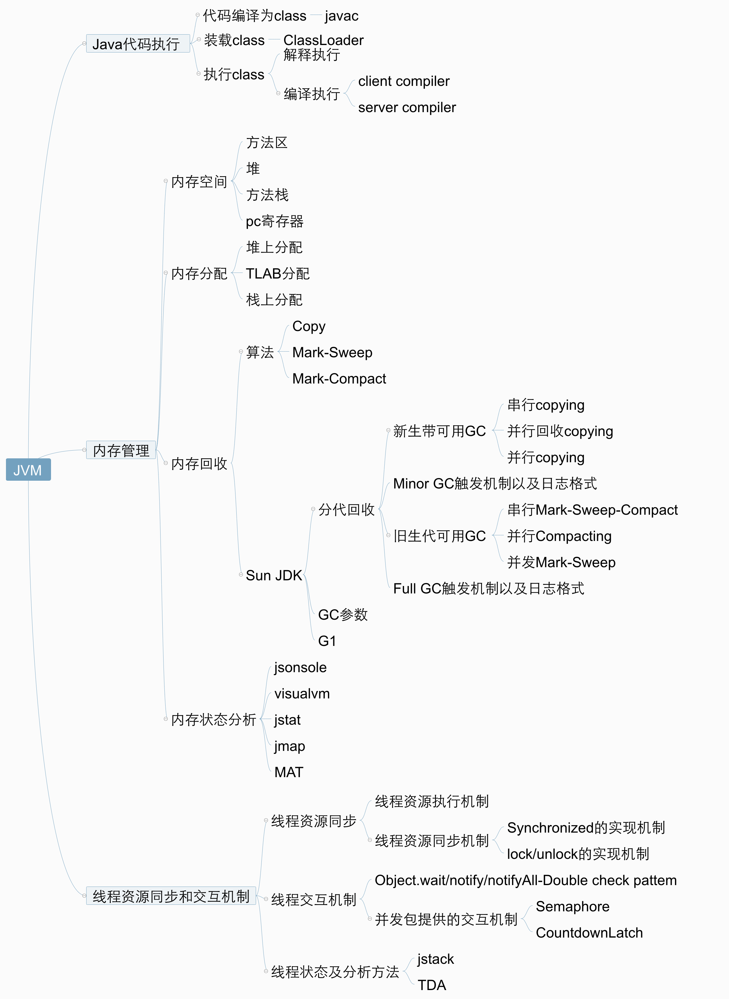
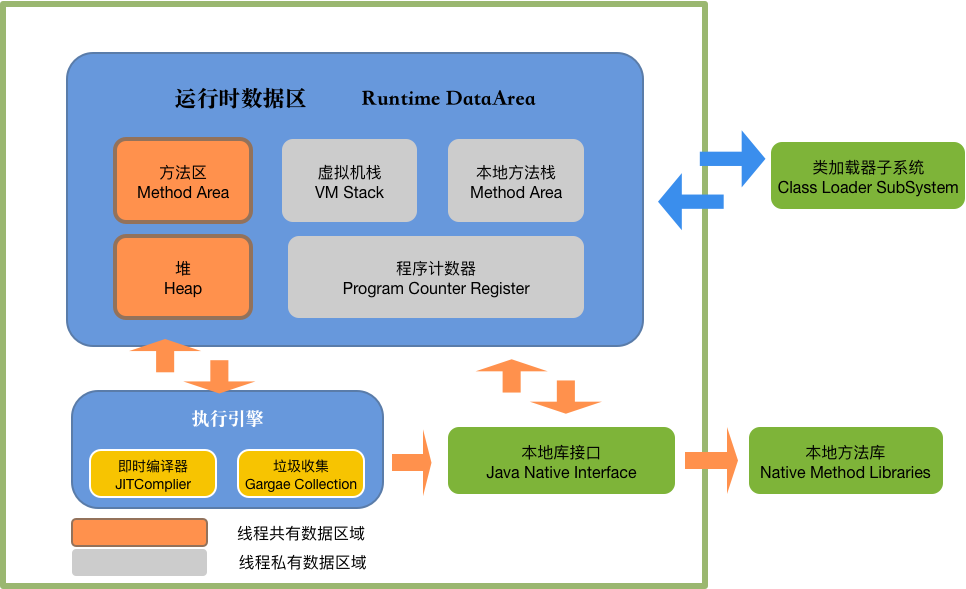

# JVM

**（1）基本概念**

​	JVM是可运行Java代码的假想计算器，包括一套字节码指令集、一组寄存器、一个栈、一个垃圾回收、堆和一个存储方法域。JVM是运行在操作系统之上，它与硬件没有直接的交互。

(2)运行过程

​	我们都知道Java源文件，通过编译器，能够产生相应的.class文件，也就是字节码文件，而字节码文件有通过Java虚拟机中的解释器，编译成特定机器上的机器码。

也就是如下：

​	①Java源文件—>编译器—>字节码文件

​	②字节码文件—>JVM—>机器码

​	每一种平台的解释器是不同的，但是实现的虚拟机是相同的，这也是Java为什么能够跨平台的原因，当一个程序从开始运行，这是虚拟机就凯斯实例化了，多个程序启动就会存在多个虚拟机示例。程序退出或者关闭，则虚拟机示例消亡，多个虚拟机示例之间数据不能共享。

## 2.1.线程

​	这里所说的线程指程序执行过程中的一个线程实体。JVM 允许一个应用并发执行多个线程。Hotspot  JVM 中的 Java 线程与原生操作系统的线程有直接的映射关系。当本地线程存储、缓存区分配、同步对象、栈、程序计数器等准备好后，就会创建一个操作系统原生线程。Java 线程结束，原生线程随之被回收。操作系统负责调度Java线程的 run() 方法。当线程结束时，会释放原生线程和 Java 线程的所有资源。

​	Hotspot JVM 后天运行的系统线程主要有下面几个：

| 虚拟机线程            (VM thread) | 这个线程等待 JVM 到达安全点操作出现。这些操作必须要在独立的线程中里执行，因为当堆修改无法进行时，线程都需要 JVM 位于安全点。这些操作的类型有： stop-the-world 垃圾回收、线程 dump、线程暂停、线程偏向锁 (biased locking) 接触 |
| ---------------------------------- | ------------------------------------------------------------ |
| 周期性任务线程                     | 这些线程负责定时器时间 (也就是中断)，用来调度周期性操作的执行 |
| GC 线程                            | 这些线程支持 JVM 中不同的垃圾回收活动。                      |
| 编译器线程 | 这些线程在运行时将字节码动态编译成本地平台相关的机器码 |
| 信号分发线程 | 这个线程接收发送到 JVM 的信号并调用适当的 JVM 方法处理 |

## 2.2.JVM 内存区域